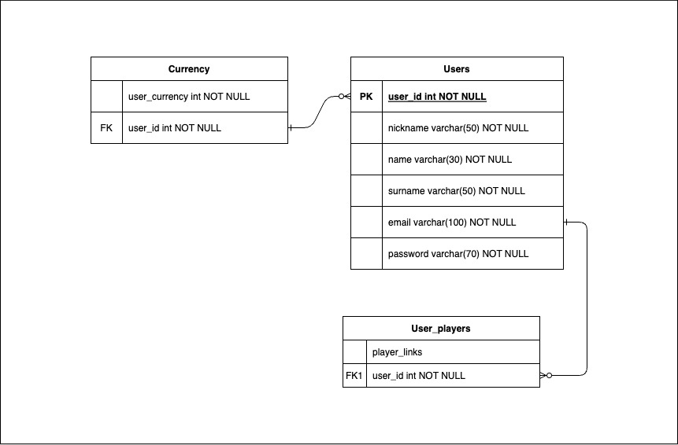

# Fullstack Project - Backend

---

## Descripción del proyecto

Este proyecto consiste en emular una plataforma de Liga estilo **fantasy** de pádel. En la que el usuario podrá elegir dos jugadores con los que participar durante el próximo torneo.
Los datos han sido extraídos de la página oficial de [World Padel Tour](https://www.worldpadeltour.com)

Dicha extracción se ha realizado mediante un `web scraping`

Cada jugador tiene su valor, dependiendo de la cantidad actual de puntos que posee en el momento de hacer el `web scraping`.

Este valor como máximo podrá ser de `30 monedas`.

Es decir, el jugador o jugadora con más puntos a la hora de obtener los datos, costará 30 monedas y los demás jugadores y jugadoras, obtendrán su valor en proporción a los puntos obtenidos

Este es uno de los dos repositorios que conforman el proyecto. [Aqui](https://github.com/aerozfx/fullstack-project-frontend.git) se puede consultar el repositorio de `frontend`

En este repositorio se han usado las siguientes librerías: `JSONWebToken`, `Express` o `Bcrypt` entre muchas otras.

**Repositorio con la parte del `servidor` de un proyecto fullstack**

---

## Contenidos

- [Idea](#idea)
  - [Links](#links)
  - [Tecnologías](#tecnologías-usadas)
  - [Modelos BBDD](#modelos-bbdd)
  - [Versión 2.0](#versión-2)
- [Autor](#autor)

### Links

- [Repositorio](https://github.com/aerozfx/fullstack-project-backend.git)
- [Demo](https://your-live-site-url.com)

## Idea

### Tecnologías usadas

- NodeJS
- Express
- JSONWebToken
- Bcrypt
- Puppeter: Encargado de realizar el `web scraping`
- MongoDB
- SQL con triggers, y consultas conjuntas

### Modelos BBDD



Modelo de MongoDB para los datos recibidos del `web scraper`

```javascript
const personalData = {
  altura: {
    type: String,
  },
  "lugar-nacimiento": {
    type: String,
  },
  "fecha-nacimiento": {
    type: String,
  },
  "posición-juego": {
    type: String,
  },
  compañero: {
    type: String,
  },
};

const schema = {
  firstName: {
    type: String,
  },
  surname: {
    type: String,
  },
  image: {
    type: String,
  },
  link: {
    type: String,
    unique: true,
  },
  price: {
    type: Number,
  },
  ranking: {
    type: Number,
  },
  puntos: {
    type: Number,
  },
  efectividad: {
    type: Number,
  },
  "victorias-consecutivas": {
    type: Number,
  },
  ganados: {
    type: Number,
  },
  jugados: {
    type: Number,
  },
  perdidos: {
    type: Number,
  },
  "partidos-jugados": {
    type: Number,
  },
  "partidos-ganados": {
    type: Number,
  },
  "datos-personales": {
    type: personalData,
  },
};
```

---

### Versión 2

La siguiente versión contendrá middlewares para proteger rutas sensibles, aunque ya tienen una medida protectora, me gustaría añadir algo más robusto.

- Añadir una columna de `active` a `User_players` para poder saber que jugadores ha alineado el jugador o jugadora para el próximo torneo y poder mostrar una respuesta adecuada en la parte del `cliente`.
- Añadir autenticación con `Google`.
- Desplegar en algun servicio **cloud** como AWS o Google Cloud.
- Modificar la BBDD de MongoDB para añadir un valor de venta a cada jugador, en función de los puntos de ranking de cada uno.
- Investigar y añadir foto de perfil personalizada para los usuarios.

## Autor

- Github - [@aerozfx](https://github.com/aerozfx)
